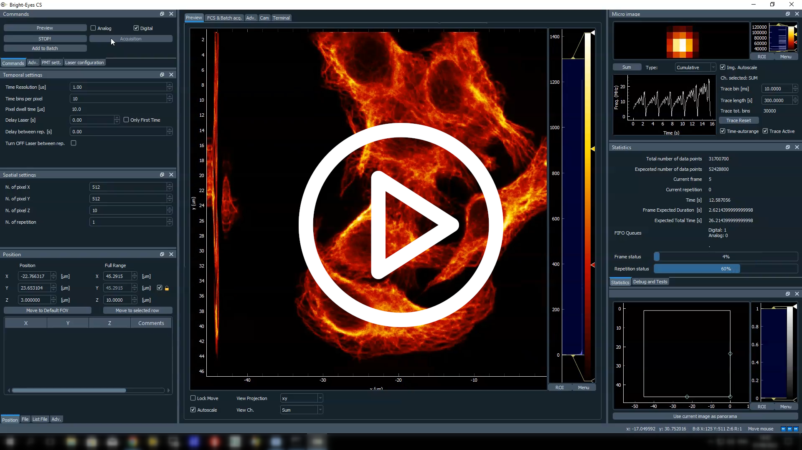
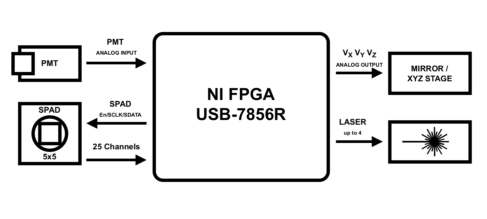
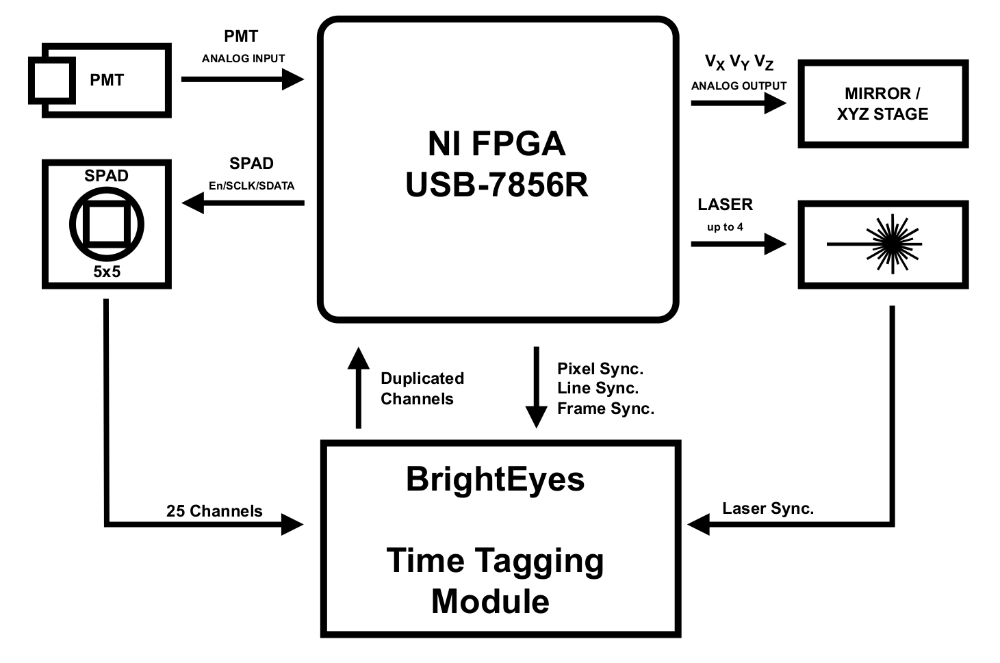
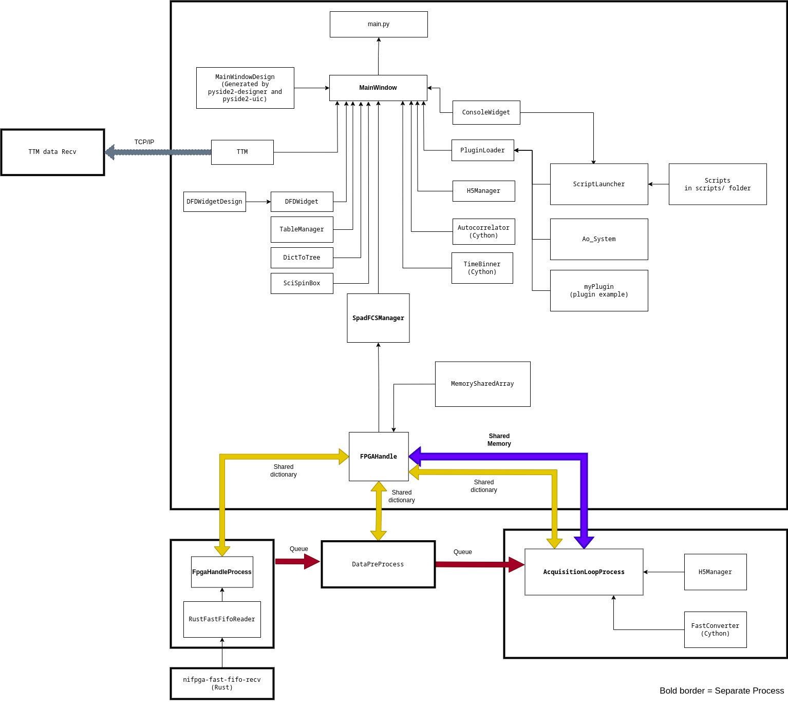

# BrightEyes-MCS

BrightEyes-MCS, a Microscope Control Software for image-scanning microscopy designed by the Molecular Microscopy and Spectroscopy group of the Italian Institute of Technology.

[docs_video_brighteyes-mcs.webm](https://user-images.githubusercontent.com/61466143/202733339-2524c826-74d9-4ebc-8885-56855706200f.webm)

<!-- [](https://user-images.githubusercontent.com/61466143/202123174-e9019c5c-bc9c-403d-b710-0516af8346b9.webm) -->
**Click on the video**

Main Features
--------

- Realtime preview
- Support up 25 digital channels (SPAD array) + 2 "extra" channel
- Support up 2 analog channels (PMT)
- Pan & Zoom in realtime
- Scan along each axis and XYZ multi-stack
- Time lapse / Macro
- Data saved in HDF5 with metadata (current configurations, extra information, users comments etc etc).
  - The saved data can be analyzed with Napari (through Napari-ISM plugin) just by a few click
- The pixel is subdivided in temporal bins:
  - Normal acquisition down-to:
    - 0.5 us for USB hardware
    - 0.25 us for Chassis Thunderbolt configuration
  - Histogram TCSPC, via Digital Frequency Domain techniques
      - 0.4 ns for bins
- Integrated Jupyter Python Console for inspecting or acting on the running program
- Plugins / Scripting in Python
  - Automatic grid analysis for calibration
- Fluorescence correlation spectroscopy Preview
- Integrated with BrightEyes-Time Tagging Module


Moreover, it can be integrated with the
[BrightEyes Time-Tagging Module](https://github.com/VicidominiLab/BrightEyes-TTM). This module allow to perform 
single-photon time-tagging microscopy therefore fluorescence spectroscopy, fluorescence lifetime imaging microscopy
(FLIM), and fluorescence lifetime correlation spectroscopy (FLFS) experiments.

---



---

# License

This program is distributed in the hope that it will be useful, 
but WITHOUT ANY WARRANTY; without even the implied warranty of 
MERCHANTABILITY or FITNESS FOR A PARTICULAR PURPOSE. 
This is free software, and you are welcome to redistribute it
under certain conditions; this software code is licensed under
the **GNU General Public License version 3** (GPLv3), with the 
exception of certain parts where a different license is specified.
Please refer to the individual source files for details on specific 
licensing exceptions.
See [LICENSE.md](LICENSE.md) file for details.


# Credits

**Author:** Mattia Donato

The authors are thanked for their valuable contributions. Below is a breakdown of the parts they have contributed to and the list of contributors.
- **BrightEyes-MCS-LowLevel**: Marco Castello, Giorgio Tortarolo, Simonluca Piazza, Mattia Donato, Eli Slenders
- **MemorySharedNumpyArray**: Sami Valtteri Koho 
- **FCS Live Preview**: Eli Slenders
- **Scripts examples (shift vectors, grid calibration, ffs analysis)**: Alessandro Zunino, Eli Slenders
- **Scientific QT Spinbox**: Luca Bega

**Scientific team**: 
[Molecular Microscopy and Spectroscopy](https://vicidominilab.github.io/), Istituto Italiano di Tecnologia:
  - **Giuseppe Vicidomini** _(Principal Investigator)_
  - Luca Bega
  - Andrea Bucci
  - Francesco Fersini
  - Giacomo Garre'
  - Marcus Held
  - Sanket Patil
  - Eleonora Perego
  - Marco Scotto
  - Eli Slenders
  - Sabrina Zappone
  - Alessandro Zunino


# Reference
- A robust and versatile platform for image scanning microscopy enabling super-resolution FLIM. _Castello, M., Tortarolo, G., Buttafava, M. et al._ Nature Methods 16, 175–178 (2019). doi: https://doi.org/10.1038/s41592-018-0291-9


- A Compact and Effective Photon-Resolved Image Scanning Microscope. _Giorgio Tortarolo, Alessandro Zunino, Simonluca Piazza, Mattia Donato, Sabrina Zappone, Agnieszka Pierzyńska-Mach, Marco Castello, Giuseppe Vicidomini_ 
bioRxiv 2023.07.28.549477; doi: https://doi.org/10.1101/2023.07.28.549477


---

# Requirements
## Hardware
BrightEyes-MCS supports only FPGA from NI. At the moment the bitfile are built for the following boards.

| Type | Board                                              | Extra req.                  | Tested                                      |
|------|----------------------------------------------------|-----------------------------|---------------------------------------------|
| 1    | NI FPGA PXIe-7856 (Single-board)                   | NI Chassis + NI Thunderbolt | Full supported, currently in use in our lab |
| 2    | NI FPGA USB-7856R (Single-board)                   | -                           | Full supported, currently in use in our lab |
| 3    | NI FPGA USB-7856R OEM (Single-board)               | -                           | Should work but not fully tested            |
| 4    | NI FPGA PXIe-7822 + NI FPGA PXIe-7856 (Dual-board) | NI Chassis + NI Thunderbolt | Should work but not fully tested            |
| 5    | NI FPGA PXIe-7820R (Dual-board)                    | No Analog integrated        | Should work but no tested                   |

**Warning!! To avoid any damage of your equipment, please verify that the pinout described in I/O Table are compatible with your actual system.**

## Software
- Python 3.10 ( https://www.python.org/downloads/ )
- Git ( https://desktop.github.com/ )
- NI FPGA drivers installed ( https://www.ni.com/en/support/downloads/software-products/download.labview-fpga-module.html )
- A C compiler:
  - [MSYS2](https://www.msys2.org/), we strongly suggest it as open-source project. Please install it in the default folder and after the MSYS2 installation remind to install `gcc` on MSYS2 terminal with the command `pacman -S mingw-w64-ucrt-x86_64-gcc`.
  - Otherwise you can use Microsoft Visual Studio (with development C++ build).


If you are a normal user jump to "Installation (for user)"

Otherwise if you are a developer, we strongly suggest to use PyCharm IDE Community editions ( https://www.jetbrains.com/pycharm/download ) for install and develop the BrightEyes-MCS.

PyCharm provides a easy graphical interfaces to donwload the source code, to create a virtual environment ("local interpreter") and to install automatically the requirements.txt. Note in any case you need to compile the Cython modules.


# Getting started


## Installation (for user)
Download the Zip from the repository. Extract it where you prefer.
Be sure to have Python 3.10 installed.

Then run the command 
```
install.bat
```
and following the instructions on the terminal.

Once installed you will have the link with icon of BrightEyes-MCS and on your Desktop.

## Firmware
**IMPORTANT**
The firmwares needed for running the NI FPGA are not included in the BrightEyes-MCS tree.
It is present during the installation phase a graphical tool to download and extract them.
In case of issues it is possible download directly from the repository of [BrightEyes-MCSLL](https://github.com/VicidominiLab/BrightEyes-MCSLL).

---

## Installation (for developer / with PyCharm)

- Open PyCharm Community Edition
- Close if other project 
  - "Get from VCS"
    - URL: ```https://github.com/VicidominiLab/BrightEyes-MCS.git```
    - Clone
- File -> Settings -> Project: brighteyes-mcs -> Python Interpreter
  - gear button (setting) -> Add
    - Virtualenv Environment  -> New environment 
      - Base interpreter select Python 3.10
      - OK
    - OK
- Add configuration
  - Add new -> Python 
  - Module -> select ```brighteyes_mcs```
- Select ```brighteyes-mcs/brighteyes-mcs/__main__.py```
- It will appers "Package requirement '....'" -> Install requirements
- Wait the installation of the packages
- Terminal
    - ```python setup.py build_ext --inplace --force``` 
- Once the file are compiled 
- Click play button


### Installation (Manual) 

Get the source tree:

```git clone https://github.com/VicidominiLab/BrightEyes-MCS.git```


Create the virtual environment:

```cd brighteyes-mcs```

```python -m venv venv```

Activate the environment 

```venv\Scripts\activate.bat``` (if you use cmd.exe)

```.\venv\Scripts\activate.ps1``` (if you use powershell)

Install requirements:

```pip install -r requirements.txt ```

Compile the Cython modules:

```python setup.py build_ext --inplace --force```

Run BrightEyes-MCS:

```run-brighteys-mcs.bat```


# Hardware:
Here below a typical connection scheme of BrightEyes-MCS.


## Microscope:
Galvo, laser, etc etc... TO-Domain


# BrightEyes-MCS-LowLevel Firmwares

## I/O Table

|                                           | I/O | USB-7856R (Single-Board) | PXIe-7856R (Single-Board) |
|-------------------------------------------|-----|----------------------|-----------------------|
| SPAD CHANNEL 0                            | IN  | Connector0/DIO0      | Connector1/DIO0       |
| ...                                       | ... | ..                   | ...                   |
| SPAD CHANNEL 15                           | IN  | Connector0/DIO15     | Connector1/DIO15      |
| SPAD CHANNEL 16                           | IN  | Connector0/DIO16     | Connector1/DIO16      |
| ...                                       | ... | ...                  | ...                   |
| SPAD CHANNEL 24                           | IN  | Connector0/DIO24     | Connector1/DIO24      |
|                                           |     |                      |                       |
| SPAD ENABLE                               | OUT | Connector0/DIO25     | Connector1/DIO25      |
| SPAD SCLK                                 | OUT | Connector0/DIO26     | Connector1/DIO26      |
| SPAD SDATA                                | OUT | Connector0/DIO27     | Connector1/DIO27      |
|                                           |     |                      |                       |
| Laser 0                                   | OUT | Connector0/DIO28     | Connector1/DIO28      |
| Laser 1                                   | OUT | Connector0/DIO29     | Connector1/DIO29      |
| Laser 2                                   | OUT | Connector0/DIO30     | Connector1/DIO30      |
| Laser 3                                   | OUT | Connector0/DIO31     | Connector1/DIO31      |
|                                           |     |                      |                       |
| AnalogINx                                 | IN  | Connector1/AIx       | Connector0/AIx        |
| AnalogOUTx                                | IN  | Connector1/AOx       | Connector0/AOx        |
|                                           |     |                      |                       |
| Pixel sync.                               | OUT | Connector1/DIO5      | Connector0/DIO5       |
| Line sync.                                | OUT | Connector1/DIO6      | Connector0/DIO6       |
| Frame sync.                               | OUT | Connector1/DIO7      | Connector0/DIO7       |
|                                           |     |                      |                       |
| Debug OUT (Analog Output updated trigger) | OUT | Connector1/DIO8      | Connector0/DIO8       |
|                                           |     |                      |                       |
| Det_extra_0                               | IN  | Connector1/DIO0      | Connector0/DIO0       |
| Det_extra_1                               | IN  | Connector1/DIO1      | Connector0/DIO1       |
|                                           |     |                      |                       |
| Laser Debug                               | OUT | Connector1/DIO11     | Connector0/DIO11      |
| Laser 0 (Duplicated)                      | OUT | Connector1/DIO12     | Connector0/DIO12      |
| Laser 1 (Duplicated)                      | OUT | Connector1/DIO13     | Connector0/DIO13      |
| Laser 2 (Duplicated)                      | OUT | Connector1/DIO14     | Connector0/DIO14      |
| Laser 3 (Duplicated)                      | OUT | Connector1/DIO15     | Connector0/DIO15      |


## Registers

| Name                           | Type       | Read/Write | Description                                                                                                                                      |
|--------------------------------|------------|------------|--------------------------------------------------------------------------------------------------------------------------------------------------|
| **Main**                       |            |            |                                                                                                                                                  |
| Run                            | Bool       | RW         | Start the scanning                                                                                                                               |
| stop                           | Bool       | RW         | Stop the scanning                                                                                                                                |
| FSM Status                     | I16        | R          | Status of the FSM                                                                                                                                |
|                                |            |            |                                                                                                                                                  |
| **Scan Settings**              |            |            |                                                                                                                                                  |
| Cx                             | I32        | RW         | Wait Cycles per bin in 40MHz clk units (default: 40)                                                                                             |
| #timebinsPerPixel              | I32        | RW         | Number of timebins per pixel                                                                                                                     |
| #pixels                        | I32        | RW         | Number of pixel (X)                                                                                                                              |
| #lines                         | I32        | RW         | Number of lines (Y)                                                                                                                              |
| #frames                        | I32        | RW         | Number of frames (Z)                                                                                                                             |
| #repetition                    | I32        | RW         | Number of repetition (REP)                                                                                                                       |
| Offset/StartValue (V)          | Fxp-Array  | RW         | Array [x,y,z] offset in V                                                                                                                        |
| CalibrationFactors(V/step)     | Fxp-Array  | RW         | Array [x,y,z] calibration in V/step                                                                                                              |
| snake                          | Bool       | RW         | If enabled the scanning is performed as "snake-scanning" else use the normal "raster scanning" (default: False)                                  |
|                                |            |            |                                                                                                                                                  |
| **Analog Output**              |            |            |                                                                                                                                                  |
| (for all channels from 0 to 7) |            |            |                                                                                                                                                  |
| AnalogOUT7                     | Fxp        | R          | Current Voltage on AnalogOUT                                                                                                                     |
| AnalogSelector_7               | U8         | RW         | 0 => X, 1 => Y, 2 => Z, else constant DC value                                                                                                   |
| AnalogOutDC_7                  | Fxp        | RW         | Constant value for Analog Output                                                                                                                 |
|                                |            |            |                                                                                                                                                  |
| **Scanning Status**            |            |            |                                                                                                                                                  |
| cur_parity                     | Bool       | R          | Current Parity Line (for snake)                                                                                                                  |
| cur_cycle                      | I32        | R          | Current Cycle                                                                                                                                    |
| cur_t                          | I32        | R          | Current timebin                                                                                                                                  |
| cur_x                          | I32        | R          | Current X                                                                                                                                        |
| cur_y                          | I32        | R          | Current Y                                                                                                                                        |
| cur_z                          | I32        | R          | Current Z                                                                                                                                        |
| cur_rep                        | I32        | R          | Current Rep                                                                                                                                      |
|                                |            |            |                                                                                                                                                  |
| **Detection Configuration**    |            |            |                                                                                                                                                  |
| initializationTime             | U32        | RW         | SPAD configuration - time to wait before start acquisition                                                                                       |
| msgOut                         | U64        | RW         | SPAD configuration message cmd send                                                                                                              |
| msgLen                         | U8         | RW         | SPAD configuration message length                                                                                                                |
| Invert SDATA                   | Bool       | RW         | SPAD configuration invert the cmd logic (useful for some SPAD prototype)                                                                         |
| ClockDur                       | I64        | RW         | SPAD configuration - sync output duration (40 MHz units)                                                                                         |
| holdOff                        | U16        | RW         | holdOff time (FPGA based) in 120 MHz units                                                                                                       |
| DummyData                      | Bool       | RW         | If enable produces dummy data instead of using data from the detector                                                                            |
|                                |            |            |                                                                                                                                                  |
| **Laser Control**              |            |            |                                                                                                                                                  |
| WaitForLaser                   | I64        | RW         | Wait after turning on laser (in 40 MHz units)                                                                                                    |
| WaitAfterFrame                 | I64        | RW         | Wait after frame completation (in 40 MHz units)                                                                                                  |
| WaitOnlyFirstTime              | Bool       | RW         | Wait after turning on laser only the first time                                                                                                  |
| LaserOffAfterMeasurement       | Bool       | RW         | If active turn off the laser after a measurement                                                                                                 |
|                                |            |            |                                                                                                                                                  |
| **Circular Scanning Settings** |            |            |                                                                                                                                                  |
| ScanXVoltages                  | Fxp-Array  | RW         | Array of Voltages X for circular scanning                                                                                                        |
| ScanYVoltages                  | Fxp-Array  | RW         | Array of Voltages Y for circular scanning                                                                                                        |
| ScanZVoltages                  | Fxp-Array  | RW         | Array of Voltages Z for circular scanning                                                                                                        |
| CircularMotionActivate         | Bool       | RW         | If activate instead of scanning will use the ScanXVoltages or the data as set via FIFOIn                                                         |
|                                |            |            |                                                                                                                                                  |
| **Scanning LImits**            |            |            |                                                                                                                                                  |
| MaxXVoltages                   | Fxp        | RW         | Set Voltages Limits Max X Voltage                                                                                                                |
| MaxYVoltages                   | Fxp        | RW         | Set Voltages Limits Max Y Voltage                                                                                                                |
| MaxZVoltages                   | Fxp        | RW         | Set Voltages Limits Max Z Voltage                                                                                                                |
| MinXVoltages                   | Fxp        | RW         | Set Voltages Limits Min X Voltage                                                                                                                |
| MinYVoltages                   | Fxp        | RW         | Set Voltages Limits Min Y Voltage                                                                                                                |
| MinZVoltages                   | Fxp        | RW         | Set Voltages Limits Min Z Voltage                                                                                                                |
|                                |            |            |                                                                                                                                                  |
| **FIFO Settings**              |            |            |                                                                                                                                                  |
| activateFIFOAnalog             | Bool       | RW         | Activate the FIFO Analog                                                                                                                         |
| activateFIFODigital            | Bool       | RW         | Activate the FIFO Digital                                                                                                                        |
| FIFOAnalog_Overflow            | Bool       | R          | True when at least once the FIFOAnalog failed during the scan                                                                                    |
| FIFO_Overflow                  | Bool       | R          | True when at least once the FIFO failed during the scan                                                                                          |
| FIFO Failed                    | U64        | R          | Counter of cycles when the FIFOAnalog failed during the scan                                                                                     |
| FIFOAnalog Failed              | U64        | R          | Counter of cycles when the FIFO failed during the scan                                                                                           |
|                                |            |            |                                                                                                                                                  |
| **Laser Enable**               |            |            |                                                                                                                                                  |
| LaserEnable0                   | Bool       | RW         | Laser Enable 1                                                                                                                                   |
| LaserEnable1                   | Bool       | RW         | Laser Enable 2                                                                                                                                   |
| LaserEnable2                   | Bool       | RW         | Laser Enable 3                                                                                                                                   |
| LaserEnable3                   | Bool       | RW         | Laser Enable 4                                                                                                                                   |
|                                |            |            |                                                                                                                                                  |
| **Analog Input**               |            |            |                                                                                                                                                  |
| AnalogInputA                   | U8         | RW         | Select the Analog input for Analog A channel                                                                                                     |
| AnalogInputB                   | U8         | RW         | Select the Analog input for Analog B channel                                                                                                     |
|                                |            |            |                                                                                                                                                  |
| AnalogA differential           | Bool       | RW         | True: signal derivative during within the timebin; False: signal direct                                                                          |
| AnalogB differential           | Bool       | RW         | True: signal derivative during within the timebin; False: signal direct                                                                          |
|                                |            |            |                                                                                                                                                  |
| (for all channels from 0 to 7) |            |            |                                                                                                                                                  |
| AnalogA7 invert                | Bool       | RW         | True: signal inverted; False: signal not inverted                                                                                                |
| AnalogA7 integrate             | Bool       | RW         | True: signal integrated; False: signal not integrated. The integration is performed at the max ADC readout speed                                 |
| AnalogIN7                      | Fxp        | R          | Current Voltage on AnalogIN                                                                                                                      |
|                                |            |            |                                                                                                                                                  |
| **Digital Frequency Domain**   |            |            |                                                                                                                                                  |
| L1                             | U8         | RW         | A state of laser sync for DFD - AAA_AAA_BBB_BBB                                                                                                  |
| L2                             | U8         | RW         | B state of laser sync for DFD - AAA_000_BBB_000                                                                                                  |
| L3                             | U8         | RW         | C state of laser sync for DFD - AA0_0BB_00C_C00                                                                                                  |
| L4                             | U8         | RW         | D state of laser sync for DFD - A00_B00_C00_D00                                                                                                  |
| DFD_Activate                   | Bool       | RW         | Activate the DFD                                                                                                                                 |
| DFD Dwell time (120MHz)        | U32        | RW         | Time interval for the transmission of full histogram (in 120MHz units) (Default: 1e6)  <= USUALLY NOT USED                                       |
| DFD_Uses_Own_Dwelltime         | Bool       | RW         | False: use the pixel index parity for triggering the transmission of the DFD histogram; True: use the Dwell time set (Default: False)            |
| DFD_LaserSyncDebug             | Bool       | RW         | True: the channel 26 become the laser time reference (needed for a proper phasor analysis); False: channel 26 is connected to the channel_extra1 |
| DFD_px_Current                 | Fxp        | R          | Status of the DFD current pixel                                                                                                                  |
| DFD_px_Transmitted             | Fxp        | R          | Status of the DFD current pixel transmitted                                                                                                      |
| DFD_FSM_Acquisition            | Bool       | R          | Status of the DFD module if activated or not                                                                                                     |
| DFD_FIFO_Overflow              | Bool       | R          | Status of the overflow of the internal DFD FIFO                                                                                                  |
|                                |            |            |                                                                                                                                                  |
| **Costum Scanning Position**   |            |            |                                                                                                                                                  |
| LastAddrPixelwise              | U32        | R          | Internal use / Debug                                                                                                                             |
| LastAddrFramewise              | U32        | R          | Internal use / Debug                                                                                                                             |
| FIFOPositionReady              | Bool       | R          | Internal use / Debug                                                                                                                             |
| position_curr_addr             | U32        | R          | Internal use / Debug                                                                                                                             |
| position_X                     | Fxp        | R          | Internal use / Debug                                                                                                                             |
| position_Y                     | Fxp        | R          | Internal use / Debug                                                                                                                             |
| position_Z                     | Fxp        | R          | Internal use / Debug                                                                                                                             |
| position_begin_tx              | Bool       | R          | Internal use / Debug                                                                                                                             |
| position_extra                 | Bool       | R          | Internal use / Debug                                                                                                                             |
| position_pixelwise-framewise   | Bool       | R          | Internal use / Debug                                                                                                                             |
| position_end_tx                | Bool       | R          | Internal use / Debug                                                                                                                             |
| offset_curr_addr               | U32        | R          | Internal use / Debug                                                                                                                             |
| offset_X                       | Fxp        | R          | Internal use / Debug                                                                                                                             |
| offset_Y                       | Fxp        | R          | Internal use / Debug                                                                                                                             |
| offset_Z                       | Fxp        | R          | Internal use / Debug                                                                                                                             |
| offset_begin_tx                | Bool       | R          | Internal use / Debug                                                                                                                             |
| offset_extra                   | Bool       | R          | Internal use / Debug                                                                                                                             |
| offset_pixelwise-framewise     | Bool       | R          | Internal use / Debug                                                                                                                             |
| offset_end_tx                  | Bool       | R          | Internal use / Debug                                                                                                                             |
|                                |            |            |                                                                                                                                                  |
| **Internal / Debug**           |            |            |                                                                                                                                                  |
| shutters                       | Bool-Array | RW         | Internal use / Debug                                                                                                                             |
| Pixel tag                      | Bool       | RW         | Internal use / Debug                                                                                                                             |
| Line tag                       | Bool       | RW         | Internal use / Debug                                                                                                                             |
| Frame tag                      | Bool       | RW         | Internal use / Debug                                                                                                                             |
| Repetition tag                 | Bool       | RW         | Internal use / Debug                                                                                                                             |
| End of frame                   | Bool       | RW         | Internal use / Debug                                                                                                                             |
| LC                             | I64        | RW         | Internal use / Debug                                                                                                                             |
| turnOffPC                      | I64        | R          | Internal use / Debug                                                                                                                             |
| turnOffLC                      | I64        | R          | Internal use / Debug                                                                                                                             |
| turnOffFC                      | I64        | R          | Internal use / Debug                                                                                                                             |
| t                              | I32        | RW         | Internal use / Debug                                                                                                                             |
| rx                             | I32        | RW         | Internal use / Debug                                                                                                                             |
| ry                             | I32        | RW         | Internal use / Debug                                                                                                                             |
| rz                             | I32        | RW         | Internal use / Debug                                                                                                                             |
| rx2                            | I32        | RW         | Internal use / Debug                                                                                                                             |
| ry2                            | I32        | RW         | Internal use / Debug                                                                                                                             |
| rz2                            | I32        | RW         | Internal use / Debug                                                                                                                             |
| rrep                           | I32        | RW         | Internal use / Debug                                                                                                                             |

## FIFOs:

| Type | Board      | Type | Read/Write | Tested                                             |
|------|------------|------|------------|----------------------------------------------------|
| 1    | FIFO In    | U64  | Write <br> \(from PC to FPGA\)      | Used only for the special case "custom positions"  |
| 2    | FIFO       | U64  | Read <br> \(from FPGA to PC\)      | Data from SPAD acquired from Digital Channels 25+2 |
| 3    | FIFOAnalog | U64  | Read <br> \(from FPGA to PC\)      | Data from selected Analog input A and B            |

### Data format:

#### Channels
Channels position on SPAD array 5x5.

|    |    |     |    |    |
|----|----|-----|----|----|
| 0  | 1  | 2   | 3  | 4  |
| 5  | 6  | 7   | 8  | 9  |
| 10 | 11  | 12  | 13  | 14  |
| 15 | 16  | 17   | 18  | 19  |
| 20 | 21  | 22   | 23  | 24  |

Moreover there are two extra channels called 25 and 26.

#### FIFO Digital
The micro-image is transmitted in a specific format made of two U64 words. 

Due to the physics of the system it has been assigned to the central elements more bits than the external ones. Here the table representing the number of bits for each channels.

Number of bit a channel:
|    |    |     |    |    |
|----|----|-----|----|----|
| 4  | 4  | 4   | 4  | 4  |
| 4  | 5  | 6   | 5  | 4  |
| 4  | 6  | 10  | 6  | 4  |
| 4  | 5  | 6   | 5  | 4  |
| 4  | 4  | 4   | 4  | 4  |

The micro-image is transmitted is trasmitted with the follwoing channels order:
- 1st word U64: 0, 1, 2, 3, 4, 5, 17, 18, 19, 20, 21, 22, 23, 24, 25. 
- 2nd word U64: 6, 7, 8, 9, 10, 11, 12, 13, 14, 15, 16, 26.


#### FIFO Analog
A word of U64 the first U32 bits are corresponding to the Analog A, and the other U32 bits are corresponding to the Analog B.

# Integration with BrightEyes Time Tagging Module


# Software:

## Scheme


The software provides a GUI interface, graphics, fast data processing and finally data saving.
Due to the high data-flux and the performace required the code uses multi process approach. This speeds up the data processing and data visualization but in the other hand is increase the complexity of the code.

The communication between process is not straightforward, but it is made by multiprocessing.Events, multiprocessing.Queue, multiprocessing.Dict and MemorySharedNumpyArray (multiprocessing.Array with some extra features).   
## Structure
(THIS PART NEEDS TO BE COMPLETLY REWRITTEN!)

The software is structured as follow:

- main.py:
   1. MainWindow.py
      - autocorrelator.pyx (Cython)
      - timeBinner (Cython)
   2. SpadFcsManager.py:
      - FpgaHandle.py:
         - FpgaHandleProcess.py (PROCESS)
      - DataPreProcess.py (PROCESS)
      - AcquisitionLoopProcess.py (PROCESS)
        - fastconverter.pyx (Cython)
        - autocorrelator.pyx (Cython)

### main.py
The main is simply the first part of the code. Here some detail some parameters are QT dark theme, application name and the MainWindow object is initialized.

### MainWindow.py
This is the core of the graphical user interface (GUI). Here object MainWindow is created and is populated by the graphical objects and the methods are "clicked", "moved" and many others are defined.
The GUI mainly designed actually with pyside2-designer and converted with pyside2-uic to Python script (guipyspadfcs.py) which is imported in this code.
The plots used in the GUI are from pyqtgraph libraries.

#### timeBinner.cpx
This is a Cython script to simply and faster the filling of a temporal plot.

### SpadFcsManager.py
This code provides the handle to control the acquisition. Ideally even without graphical interface this code would allows an used to control, acquire and save data.

### FpgaHandle.py and FpgaHandleProcess.py
The FpgaHandle is an interface to manage the FpgaHandelProcess. This last one is an interface to the NIFPGA library. Essentially there is an initialization part and the core is a "forever loop" where - if requested - FIFOs or written are read or written. The communication to this process is warranty by a Queue mechanism.

#### DataPreProcess.py
This module convert the data received from the FIFOs (through a Queue connected to FpgaHandleProcess) to an numpy array.

#### AcquisitionLoopProcess.py
It converts the data received from the DataPreProcess to an image by taking advantages the fastconverter.pyx. Moreover,  if requested. It is possible also to calculate the live correlation (FCS) throught the autocorrelator.pyx 

##### autocorrelator.pyx
It is a Cython code for calculating live the autocorrelation of a given data. The input samples can be added at anytime with any size. The result is an approximation of the autocorrelation curve.

##### fastconverter.pyx 
It is a Cython code used to convert the low level data format (defined in the NI FPGA code) to an numpy.array easier to manage with python.


