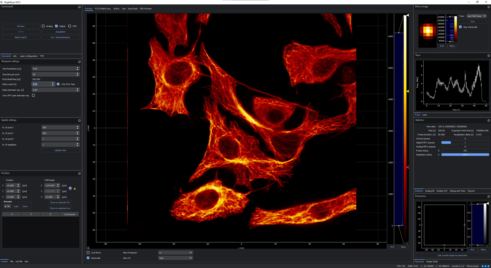

# BrightEyes-MCS

BrightEyes-MCS, a Microscope Control Software for image-scanning microscopy designed by the Molecular Microscopy and Spectroscopy group of the Italian Institute of Technology. 

[docs_video_brighteyes-mcs.webm](https://user-images.githubusercontent.com/61466143/202733339-2524c826-74d9-4ebc-8885-56855706200f.webm)

<!-- [](https://user-images.githubusercontent.com/61466143/202123174-e9019c5c-bc9c-403d-b710-0516af8346b9.webm) -->
**Click on the video**
## Development Notice

**Important:** This software is currently under active development and may contain bugs or incomplete features. Please use it with caution and report any issues you encounter to help us improve the application.

Main Features
--------

- Realtime preview
- Support up 25 digital channels (SPAD array) + 2 "extra" channel
- Support up 2 analog channels (PMT)
- Pan & Zoom in realtime
- Scan along each axis and XYZ multi-stack
  - (Supported up to 3 linear voltage-controlled actuator *i.e.* galvo mirror or piezo-stage)
- Time lapse / Macro
- Data saved in HDF5:
  - Multi-dimensional `[repetition, z, y, x, t_bin, channel]` array.
  - Metadata (current configurations, extra information, users comments etc etc).
  - The data can be analyzed a visualized directly with Napari (through [Napari-ISM](https://www.napari-hub.org/plugins/napari-ISM) plugin) just by a few click
- The pixel is subdivided in temporal bins:
  - Normal acquisition down-to:
    - 0.5 us for USB hardware
    - 0.25 us for Chassis Thunderbolt configuration
  - Histogram TCSPC, via Digital Frequency Domain techniques
      - 0.4 ns for bins
- Integrated Jupyter Python Console for inspecting or acting on the running program
- Plugins / Scripting in Python
  - Automatic grid analysis for calibration
- Fluorescence correlation spectroscopy Preview
- Integrated with BrightEyes-Time Tagging Module


Moreover, it can be integrated with the
[BrightEyes Time-Tagging Module](https://github.com/VicidominiLab/BrightEyes-TTM). This module allow to perform 
single-photon time-tagging microscopy therefore fluorescence spectroscopy, fluorescence lifetime imaging microscopy
(FLIM), and fluorescence lifetime correlation spectroscopy (FLFS) experiments.

---


---


---

# Requirements 

## Software
- Windows OS
- Python **3.10**
- - Download [installer](https://www.python.org/ftp/python/3.10.8/python-3.10.8-amd64.exe)
- - Or `winget install -e --id Python.Python.3.10`
- Git
- - [Git for Windows] (https://gitforwindows.org/)
- - Or `winget install -e --id Git.Git`
- FPGA drivers installed,
- - NI R Series Multifunction [RIO driver](https://www.ni.com/en/support/downloads/drivers/download.ni-r-series-multifunction-rio.html)
- A **C compiler** installer, either
  - GCC [MSYS2](https://www.msys2.org/) (`winget install -e --id MSYS2.MSYS2`)
  - or Microsoft Visual Studio with C++ build tools.


## Hardware
BrightEyes-MCS supports only FPGA from NI. At the moment the bitfile are built for the following boards.

| Type | Board                                              | Extra req.                  | Tested                                      |
|------|----------------------------------------------------|-----------------------------|---------------------------------------------|
| 1    | NI FPGA PXIe-7856 (Single-board)                   | NI Chassis + NI Thunderbolt | Full supported, currently in use in our lab |
| 2    | NI FPGA USB-7856R (Single-board)                   | -                           | Full supported, currently in use in our lab |
| 3    | NI FPGA USB-7856R OEM (Single-board)               | -                           | Should work but not fully tested            |
| 4    | NI FPGA PXIe-7822 + NI FPGA PXIe-7856 (Dual-board) | NI Chassis + NI Thunderbolt | Full supported, currently in use in our lab |
| 4    | NI FPGA PXIe-7822 (Single-board)                   |  NI Chassis + NI Thunderbolt +  External DAC required       | Full supported, currently in use in our lab |
| 5    | NI FPGA PCIe-7820R                                 | External DAC required       | Full supported, currently in use in our lab |

**Warning!! To avoid any damage of your equipment, please verify that the pinout described in I/O Table are compatible with your actual system.**

## I/O table
The I/O table depeands by the firmware. The tables are available on the documentations of [BrightEyes-MCSLL](https://github.com/VicidominiLab/BrightEyes-MCSLL)


# Getting started
## Installation 


There are two possibility:
- Download the [Zip](https://github.com/VicidominiLab/BrightEyes-MCS/archive/refs/heads/main.zip) of the repository and extract it where you prefer
- Or clone the repo:
- - `git clone https://github.com/VicidominiLab/BrightEyes-MCS.git`

Python **3.10** and the MSYS2 or Visual Studio C++ MUST BE installed before run the installer!

From the cmd.exe (NOT powershell!)

```
cd BrightEyes-MCS
install.bat
```

and following the instructions on the terminal.
Once installed you will have the link with icon of BrightEyes-MCS and on your Desktop.

---


# Graphical User Interface (GUI)

The GUI is designed around the preview image, and it is composed by three parts.




- **Left Panel**:

  * **Top**:
    * Start/stop the preview or the real acquisition.
    * Choose between analogue and digital detectors and initiate either acquisition or preview mode. In acquisition, options include DFD mode for lifetime analysis and TTM activation (not part of this project).
    * Laser tab to turn on/off each lasers.
    * Advanced configuration includes bidirectional scanning (snake walk) and the cirucular motion (for circular FCS)

  * **Temporal Settings**: Configure time resolution, dwell time, and laser delays.

  * **Spatial settings**: Set pixel, line, frame, and repetition values for your imaging session.

  * **Bottom**:
    * Position: position and range, preset load/save, list of markers
    * File: destinatio folder, filename (DEFAULT.h5 force a actual time as filename) and textbox where is possible to set comments saved on the metadata
    * List File: list of the acquired data
    * Advanced:
      * Calibration settings
      * Board configurations
      * SPAD (for old SPAD prototype electronics configuration)
      * Default FOV
      * Limits (and offset) of positioner
      * External tools: set the string for integration with napari
      * Http Server: configuration of the REST API server
      * TTM: configuration for integration with TTM data receiver
      * FIFOs: settings of the FIFOs - for developer.

- **Central Area**:
  
  * **Preview Tab**: Observe real-time image preview during acquisition. Pan and zoom functionalities are enabled. Double-click on a position centering the image on it. CTRL+Double-click add a marker.

  * **FCS & Batch acq.**: Allow the autocorrelation preview for FCS, set up batch (macro) acquisiton

  * **Status**: A debug function for reading the status of the registers

  * **Cam**: A preview for external camera 

  * **ScriptLauncher**: A Python QTConsole in which all objects of the running software are exposed.
  
  * **DFD Preview**: A post-acquistion preview for FLIM

- **Right Panel**:

  * **Micro-Image Display**: View a 5x5 micro-image with options for cumulative or end-of-frame updates. Pixel saturation indication are highlighted in blue.

  * **Trace**: Track photon flux trends for the selected channel or sum throughout the scanning process. Double-click on the trace reset it. And tab for its configuration.

  * **Middle**:

    - **Statistics**: Access imaging statistics for in-depth analysis.

    - **Analog IN**: Choose input options for analogue inputs.

    - **Analog OUT**: Define functionality for analogue outputs (scanning X, Y, Z, or constant voltage).

    - **Menu & Debug**: Explore test functionalities.

    - **Plug-ins Management**: Load and manage plugins seamlessly.

  * **Panorama Image**: Generate and update a panoramic image with the current preview image.
  * **Image Script**: Placeholder that can be used by the script.

The commands are intuitive, and the software highlights possible error of configuration such to minimize the user errors.


# License

This program is distributed in the hope that it will be useful, 
but WITHOUT ANY WARRANTY; without even the implied warranty of 
MERCHANTABILITY or FITNESS FOR A PARTICULAR PURPOSE. 
This is free software, and you are welcome to redistribute it
under certain conditions; this software code is licensed under
the **GNU General Public License version 3** (GPLv3), with the 
exception of certain parts where a different license is specified.
Please refer to the individual source files for details on specific 
licensing exceptions.
See [LICENSE.md](LICENSE.md) file for details.

## Firmware License
**IMPORTANT**
The firmwares needed for running the NI FPGA are not included in the BrightEyes-MCS tree.
It is present during the installation phase a graphical tool to download and extract them.
In case of issues it is possible download directly from the repository of [BrightEyes-MCSLL](https://github.com/VicidominiLab/BrightEyes-MCSLL).


## Community Guidelines

We welcome contributions to BrightEyes-MCS from the community. Below are the general guidelines for those who want to get involved:

1. **Contributing**: If you want to contribute to the software, you can fork the repository, make your changes, and submit a pull request. We recommend getting in touch with the maintainers before starting work on major features to avoid duplicating efforts.
2. **Reporting Issues**: You can report any bugs, issues, or feature requests by opening a new issue on the GitHub repository. Please ensure that you include as much detail as possible, including steps to reproduce the issue and your environment details (operating system, Python version, hardware setup).
3. **Seeking Support**: For questions or technical assistance, you can start a discussion in the "Discussions" tab of the repository, or check the FAQ section in the project's documentation. For immediate support or collaborations, you can contact the developers through the contact information provided on the project website.

---

## Contributing

Contributions are welcome in the form of code, documentation, testing, or suggestions. Here's how you can contribute:

1. **Fork the Repository**: Create a personal copy of the BrightEyes-MCS repository by clicking on "Fork".
2. **Clone the Repository**: Clone the forked repository to your local machine using `git clone`.
3. **Create a Branch**: Create a new branch for your feature or bug fix.
4. **Make Changes**: Implement your changes, ensuring that your code is well-documented and follows the project's coding guidelines.
5. **Test Your Changes**: Ensure that all tests pass and add new ones if necessary.
6. **Submit a Pull Request**: Once you're happy with your changes, submit a pull request to the main repository for review. Provide a clear description of the changes and reference any related issues.

For detailed instructions on how to set up your development environment, please refer to the [Installation](#Installation) section of the README.

---

# Credits

**Author:** Mattia Donato

The authors are thanked for their valuable contributions. Below is a breakdown of the parts they have contributed to and the list of contributors.
- **BrightEyes-MCS-LowLevel**: Marco Castello, Giorgio Tortarolo, Simonluca Piazza, Mattia Donato, Eli Slenders
- **MemorySharedNumpyArray**: Sami Valtteri Koho 
- **FCS Live Preview**: Eli Slenders
- **Scripts examples (shift vectors, grid calibration, ffs analysis)**: Alessandro Zunino, Eli Slenders
- **Scientific QT Spinbox**: Luca Bega

**Scientific team**: 
[Molecular Microscopy and Spectroscopy](https://vicidominilab.github.io/), Istituto Italiano di Tecnologia:
  - **Giuseppe Vicidomini** _(Principal Investigator)_
  - Luca Bega
  - Andrea Bucci
  - Mattia Donato
  - Francesco Fersini
  - Giacomo Garre'
  - Marcus Held
  - Sanket Patil
  - Eleonora Perego
  - Marco Scotto
  - Eli Slenders
  - Sabrina Zappone
  - Alessandro Zunino


# Reference
- A robust and versatile platform for image scanning microscopy enabling super-resolution FLIM. _Castello, M., Tortarolo, G., Buttafava, M. et al._ Nature Methods 16, 175–178 (2019). doi: https://doi.org/10.1038/s41592-018-0291-9


- A Compact and Effective Photon-Resolved Image Scanning Microscope. _Giorgio Tortarolo, Alessandro Zunino, Simonluca Piazza, Mattia Donato, Sabrina Zappone, Agnieszka Pierzyńska-Mach, Marco Castello, Giuseppe Vicidomini_ 
bioRxiv 2023.07.28.549477; doi: https://doi.org/10.1101/2023.07.28.549477


