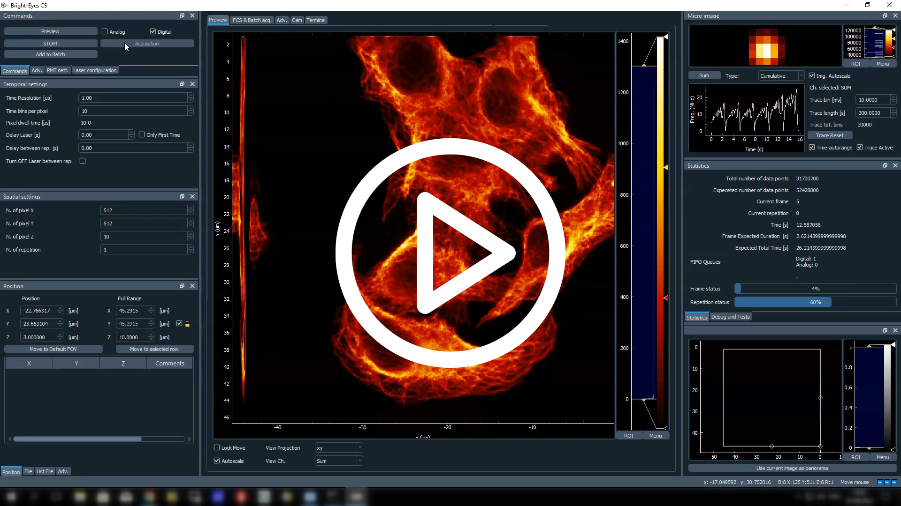

# BrightEyes-MCS

BrightEyes-MCS, a Microscope Control Software for image-scanning microscopy designed by the Molecular Microscopy and Spectroscopy group of the Italian Institute of Technology. 

For complete documentation, please visit our [Wiki page](https://github.com/VicidominiLab/BrightEyes-MCS/wiki).

[docs_video_brighteyes-mcs.webm](https://user-images.githubusercontent.com/61466143/202733339-2524c826-74d9-4ebc-8885-56855706200f.webm)

<!-- [](https://user-images.githubusercontent.com/61466143/202123174-e9019c5c-bc9c-403d-b710-0516af8346b9.webm) -->
**Click on the video**

## Quick Start

To get started, refer to the detailed instructions and guidelines available on the [Wiki](https://github.com/VicidominiLab/BrightEyes-MCS/wiki).

BrightEyes-MCS is a Windows-focused application. Python 3.13 (64-bit) is the
recommended runtime; the package metadata permits Python 3.10 and newer. The NI
drivers and FPGA firmware required for physical acquisition are installed
separately and are not distributed in the Python package.

Install Python 3.13 (64-bit) from
[python.org](https://www.python.org/downloads/windows/), then create a dedicated
environment and install BrightEyes-MCS from PyPI:

```powershell
py -3.13 -m venv "$env:LOCALAPPDATA\BrightEyes-MCS\venv"
$BrightEyesPython = "$env:LOCALAPPDATA\BrightEyes-MCS\venv\Scripts\python.exe"
& $BrightEyesPython -m pip install --upgrade pip
& $BrightEyesPython -m pip install brighteyes-mcs
& $BrightEyesPython -m brighteyes_mcs
```

The first launch offers to create a Desktop shortcut for that environment. The
shortcut uses `pythonw.exe -m brighteyes_mcs`; BrightEyes-MCS
does not build or install an application executable. To reopen shortcut setup:

```powershell
& $BrightEyesPython -m brighteyes_mcs --setup
```

To upgrade later:

```powershell
& $BrightEyesPython -m pip install --upgrade brighteyes-mcs
```

Optional built-in plugin dependencies can be installed with extras:

```powershell
& $BrightEyesPython -m pip install "brighteyes-mcs[ao]"    # serial-controlled AO hardware
& $BrightEyesPython -m pip install "brighteyes-mcs[flim]"  # FLIM/DFD analysis
```

The NI drivers and FPGA firmware used for physical acquisition remain separate
from the PyPI package. Follow the hardware setup instructions in the project
Wiki after installing the application.

## Compiled Extensions

The compiled extension modules are distributed separately as
`brighteyes-mcs-cylibs`. Pip installs a compatible wheel automatically as a
BrightEyes-MCS dependency; this repository does not compile them during
installation.

## Development

Project metadata and developer dependencies are defined in `pyproject.toml`:

```powershell
python -m pip install -e ".[dev]"
python -m pytest -q
python -m unittest test.test_channel_delay_skew_plugin -v
```

The second test command intentionally runs the PySide channel-delay widget tests
in a separate interpreter on Windows/Python 3.13. See
`docs/refactoring-architecture.md` for the package boundaries and compatibility
rules.

Maintainers can find the complete build, validation, TestPyPI, and Trusted
Publishing procedure in the
[PyPI release guide](https://github.com/VicidominiLab/BrightEyes-MCS/blob/main/docs/pypi-release.md).

## Development Notice

**Important:** This software is currently under active development and may contain bugs or incomplete features. Please use it with caution and report any issues you encounter to help us improve the application. 

For contribution guidelines, refer to
[CONTRIBUTING.md](https://github.com/VicidominiLab/BrightEyes-MCS/blob/main/CONTRIBUTING.md).

## License

This program is distributed in the hope that it will be useful, but WITHOUT ANY WARRANTY; without even the implied warranty of MERCHANTABILITY or FITNESS FOR A PARTICULAR PURPOSE. This is free software, and you are welcome to redistribute it under certain conditions; this software code is licensed under the GNU General Public License version 3 or later (GPLv3+), with the exception of certain parts where a different license is specified. Please refer to the individual source files for details on specific licensing exceptions. See LICENSE.md file for details.


## Referencing BrightEyes-MCS

If this software is part of your research, please acknowledge it by citing:

- BrightEyes-MCS: a control software for multichannel scanning microscopy. _Donato et al._, Journal of Open Source Software (2024), 9(103), 7125, doi: https://doi.org/10.21105/joss.07125
