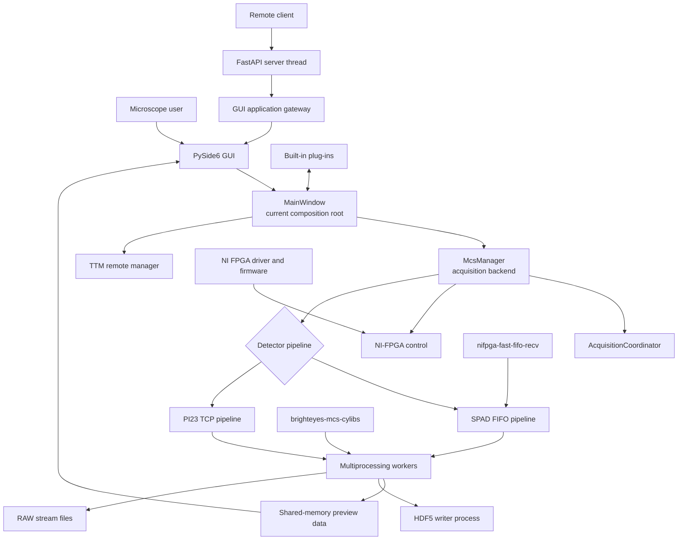
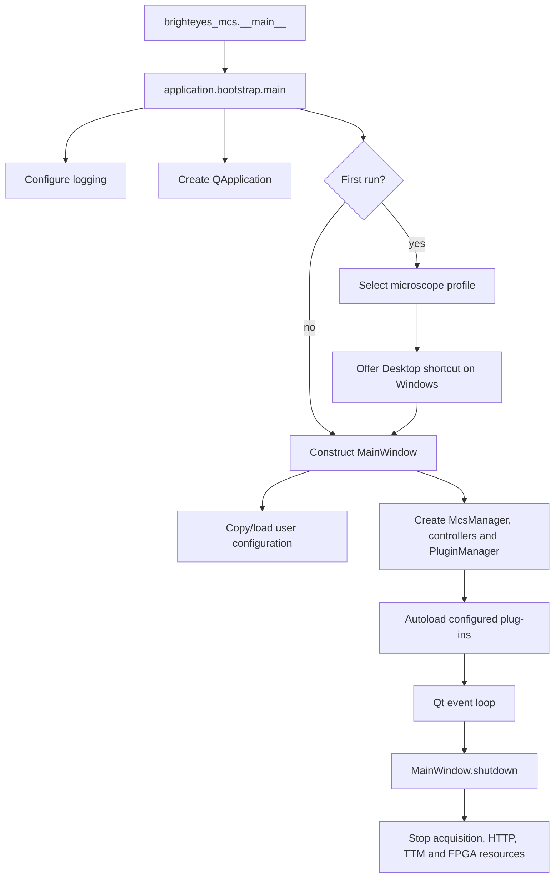
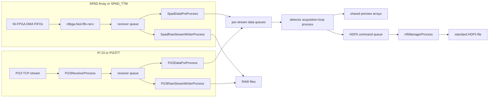

# BrightEyes-MCS: current architecture and repository map

> Snapshot: **12 August 2026**, BrightEyes-MCS **1.1.1**. This document describes
> the current working tree, including modifications that are not yet committed.
> It is a map of what exists now, not a proposal for a future rewrite.

## One-page view

BrightEyes-MCS is a Windows-focused PySide6 desktop application for controlling
image-scanning microscopes. The main Python package coordinates the GUI, NI-FPGA
scan control, SPAD or PI23 detector data, multiprocessing workers, live previews,
HDF5/RAW storage, plug-ins, TTM control, and an optional HTTP API.



The most important practical fact is that
[`MainWindow`](../brighteyes_mcs/ui/qt/main_window.py) is still the real
application orchestrator. New controllers and services exist, but they wrap or
extract selected responsibilities; they do not yet replace the main window.

## Repository map

```text
BrightEyes-MCS/
├── brighteyes_mcs/          Installed application package (the active product)
│   ├── application/         Bootstrap, paths, contracts, plug-ins, Windows setup
│   ├── acquisition/         Manager, pipelines, processes, shared memory, state
│   ├── hardware/            NI-FPGA and TTM adapters
│   ├── storage/             HDF5, RAW, legacy config and name translation
│   ├── api/                 FastAPI/HTTP control surface
│   ├── ui/
│   │   ├── controllers/     Small extracted UI-independent behaviors
│   │   └── qt/              Main window, widgets, generated Designer code
│   ├── plugins/             Plug-in API, template and built-in plug-ins
│   ├── scripts/             Bundled ScriptLauncher analysis/calibration scripts
│   ├── cfg/                 Packaged default and plug-in configurations
│   ├── images/              Packaged icon and splash resources
│   └── bitfiles/            Local firmware area; firmware is not packaged
├── test/                    Unit, integration, Qt and hardware-facing tests
├── docs/                    Architecture, register and HDF5 documentation
├── scripts/                 Developer distribution and conversion tools
├── raw-fpga-converter/      Stand-alone SPAD RAW-to-HDF5 converter copy
├── blueskyproject_mcs/      Separate Bluesky/Ophyd register-map project
├── notebook/                Experiments, analysis notebooks and local data
├── data/                    Placeholder data directory
├── installer/               Currently empty after installer removal
├── dist/                    Local wheel and source-distribution build output
├── pyproject.toml           Authoritative package metadata and dependencies
└── README.md                Installation and development entry point
```

Only packages matching `brighteyes_mcs*` are included by the root build.
`blueskyproject_mcs`, `raw-fpga-converter`, notebooks, the top-level `scripts/`
directory, tests, and local build output are not importable parts of the
installed application package.

## Package ownership

| Area | Owns | Important files |
| --- | --- | --- |
| `application` | Startup, resource/user paths, service protocols, plug-in loading, Windows shortcut setup | [`bootstrap.py`](../brighteyes_mcs/application/bootstrap.py), [`paths.py`](../brighteyes_mcs/application/paths.py), [`plugin_service.py`](../brighteyes_mcs/application/plugin_service.py), [`windows_integration.py`](../brighteyes_mcs/application/windows_integration.py) |
| `acquisition` | Acquisition lifecycle, detector selection, processes, queues, shared arrays, preview data | [`manager.py`](../brighteyes_mcs/acquisition/manager.py), [`coordinator.py`](../brighteyes_mcs/acquisition/coordinator.py), [`detectors/`](../brighteyes_mcs/acquisition/detectors), [`workers/`](../brighteyes_mcs/acquisition/workers) |
| `hardware` | Hardware-facing NI-FPGA and TTM adapters | [`fpga.py`](../brighteyes_mcs/hardware/fpga.py), [`ttm.py`](../brighteyes_mcs/hardware/ttm.py) |
| `storage` | Stable serialized formats and their legacy translations | [`h5.py`](../brighteyes_mcs/storage/h5.py), [`h5_schema.py`](../brighteyes_mcs/storage/h5_schema.py), [`legacy_config.py`](../brighteyes_mcs/storage/legacy_config.py), [`converters/`](../brighteyes_mcs/storage/converters) |
| `api` | HTTP status, command, configuration and image endpoints | [`rest.py`](../brighteyes_mcs/api/rest.py) |
| `ui/controllers` | Extracted configuration, lifecycle projection and preview selection | [`controllers/`](../brighteyes_mcs/ui/controllers) |
| `ui/qt` | Qt widgets and the current GUI composition root | [`main_window.py`](../brighteyes_mcs/ui/qt/main_window.py), [`main_window_design.ui`](../brighteyes_mcs/ui/qt/main_window_design.ui), [`flim_image_view.py`](../brighteyes_mcs/ui/qt/flim_image_view.py) |
| `plugins` | Small public plug-in API and built-in feature packages | [`api.py`](../brighteyes_mcs/plugins/api.py), [`builtin/`](../brighteyes_mcs/plugins/builtin), [`_template/`](../brighteyes_mcs/plugins/_template) |
| `logging_setup.py` | Process-wide standard-library logging setup | [`logging_setup.py`](../brighteyes_mcs/logging_setup.py) |

Dependency direction should normally be:

```text
Qt UI / HTTP adapter
        ↓
application services and controllers
        ↓
acquisition ─────→ hardware
        ↓
      storage
```

Acquisition workers must not import Qt. Serialized-format mappings belong in
`storage`, not in the GUI or detector pipelines.

## Startup and shutdown

The supported installed entry point is:

```powershell
python -m brighteyes_mcs
```



Startup flags:

- `--help` / `-h`: print launcher usage without importing or starting Qt.
- `--setup`: show system-profile and shortcut setup again.
- `--no-first-run`: skip first-run setup.

The application shortcut launches the environment's
`pythonw.exe -m brighteyes_mcs`. A default-enabled second shortcut launches
`cmd.exe /K <environment>\Scripts\activate.bat` and uses `python.exe` as its
icon, providing a shell in the correct environment. A third default-enabled
shortcut targets the selected profile's expanded system-root directory and uses
the standard Windows folder icon. The normal PyPI workflow does not install or
build a BrightEyes-MCS application EXE.

The final central **About** tab contains project credits and citation details,
the BrightEyes-MCS GPL notice and full license, third-party licensing guidance,
and the separate BrightEyes-MCSLL firmware license and credits. Dynamically
loaded plug-in tabs are inserted immediately before About so it remains last.

## Configuration and runtime paths

There are two different kinds of configuration location:

1. Immutable packaged defaults are under `brighteyes_mcs/cfg`.
2. Writable user configuration is copied to `%APPDATA%/BrightEyes-MCS` on first
   run. `%LOCALAPPDATA%` is the fallback if `APPDATA` is unavailable.

The pointer `%APPDATA%/BrightEyes-MCS/current_system` is always per-user. It
selects a complete microscope profile, whose root may itself be per-user or
shared. The first-run dialog and the GUI's **System…** button edit this file.
For example:

```ini
[BrightEyes-MCS]
root = %PROGRAMDATA%\BrightEyes-MCS\systems\microscope-1
configuration_dir = cfg
default_configuration = default.cfg
plugins_dir = cfg\plugins_cfg
plugin_packages_dir = plugins
scripts_dir = scripts
bitfiles_dir = firmware
```

All directory settings may be absolute or relative to `root`. `%NAME%`,
`$NAME`, and `${NAME}` environment-variable notation is expanded. A profile's
configuration directory may contain any number of `.cfg` files; only
`default_configuration` is loaded automatically. Paths beginning with `cfg/`,
`cfg/plugins_cfg/`, `plugins/`, `scripts/`, `bitfiles/`, or `firmware/` are
redirected to the corresponding selected folder. `plugins_dir` stores plug-in
configuration files; `plugin_packages_dir` stores executable plug-in packages.
Historical `current_system` files pointing directly to one `.cfg` remain
supported.

The shared `SystemProfileEditor` used by both first-run setup and the main
window can create the configured root and subfolders. It copies the packaged
`default.cfg` and plug-in defaults only when their destination files are
missing, so an existing microscope configuration is not overwritten.

It can also download any explicitly selected branch of the official
`BrightEyes-MCSLL` repository as a GitHub ZIP. Archive paths are validated
before extraction, the generated GitHub root directory is removed, and files
are written into the profile's `bitfiles_dir`. Firmware remains outside the
wheel and subject to the separate BrightEyes-MCSLL license; the GUI requires
confirmation before downloading it.

First-run setup is a `QWizard` with Welcome, Profile, Structure, Firmware,
Shortcuts, and Finish pages. The Structure page checks every configured
directory plus the default `.cfg`; missing items are displayed and creation is
selected by default. Existing files are never overwritten. Firmware download
is opt-in and retains its separate license confirmation. Each Windows shortcut
is independently selectable and enabled by default. Firmware branch selection,
license acceptance, progress, success, and errors are embedded in the wizard
page. Its worker thread disables wizard navigation during transfer and advances
only after a successful extraction; it does not open the standalone firmware
dialog used by the main System editor.

Shared profiles should normally be read-only for ordinary users, particularly
when they contain Python scripts or plug-ins. Logs, shortcut state, and other
runtime state remain per-user.

Logs normally go to `%LOCALAPPDATA%/BrightEyes-MCS/log`; `BRIGHTEYES_LOG_DIR`
can override the location.

The `.cfg` files are JSON payloads despite the extension. The legacy key schema
is a stable external contract. `LegacyConfigurationCodec` preserves it, while
`LegacyConfigurationTranslator` can build typed `AcquisitionConfig` data.
Currently, the main window still consumes the legacy dictionary directly; the
typed configuration is not yet the main runtime representation.

## Runtime composition

`MainWindow` currently constructs and owns:

- `McsManager`, the main acquisition backend;
- `ConfigurationController`, `LifecycleController`, and `PreviewController`;
- `PluginManager` and the plug-in event signal;
- preview, fingerprint, FLIM, trace, FCS and monitor widgets;
- timers for display refresh, acquisition progress and FPGA watchdog behavior;
- optional `FastAPIServerThread` and `TtmRemoteManager` instances;
- acquisition configuration mapping, finalization, HDF5 metadata and much of
  the hardware command workflow.

`McsManager` owns:

- `AcquisitionCoordinator`, which wraps start/stop and records backend errors;
- `FpgaHandle`, which owns the NI-FPGA control process;
- the selected `SpadDetectorPipeline` or `Pi23DetectorPipeline`;
- `ProcessSupervisor`, `SharedMemoryRegistry`, `PreviewRepository`, and
  `AcquisitionStorage`;
- multiprocessing events, manager dictionaries, counters and queues.

## Acquisition modes

| Mode | `do_not_save` | `raw_stream_mode` | Preview arrays | HDF5 writer | Main worker |
| --- | ---: | ---: | --- | --- | --- |
| Preview | yes | no | enabled | disabled | acquisition/preview loop |
| Normal acquisition | no | no | enabled | enabled | acquisition/preview loop |
| RAW streaming | no | yes | disabled | metadata is handled separately by the GUI; bulk HDF5 writer is disabled | detector-specific RAW writer |

All three modes still use the scan-control FPGA session. The difference is how
detector data are received, processed and stored.

### Detector data paths



For PI23, NI-FPGA remains the scan-control surface, but its detector FIFO is not
used. Detector payload comes from the PI23 TCP receiver. The PI23 emulator in
[`detectors/pi23/emulator.py`](../brighteyes_mcs/acquisition/detectors/pi23/emulator.py)
provides a software source for development.

### Processes and communication

| Process/thread | Purpose | Main communication |
| --- | --- | --- |
| Qt main thread | GUI, timers, configuration and orchestration | Qt signals, manager API, shared-array reads |
| `NiFpgaControlProcess` | NI session, register and SPAD FIFO control | manager queues/events and Rust FIFO reader |
| PI23 receiver process | Receive detector TCP bunches | multiprocessing receiver queue |
| detector preprocessor process | Batch/repack receiver payloads | receiver queue to per-stream data queues |
| detector acquisition-loop process | Decode, aggregate, preview and request HDF5 writes | shared memory, shared dict, HDF5 command queue |
| detector RAW writer process | Write native stream payloads directly | receiver queue to `.raw` files |
| `H5ManagerProcess` | Own the HDF5 file and perform serialized writes | command/response queues |
| FastAPI server thread | Optional remote API through Uvicorn | Qt signals through `GuiApplicationGateway` |

`ProcessSupervisor` registers the receiver, preprocessor, preview loop and RAW
writer by name. `AcquisitionStorage` separately owns the HDF5 writer process.

## Preview data

In preview and normal modes, `SharedMemoryRegistry` allocates arrays for:

- XY, XZ and ZY intensity projections;
- RGB and lifetime/HCL image products;
- detector fingerprint and mask;
- autocorrelation, intensity trace and DFD trace.

The acquisition-loop process writes these arrays. Qt timers read them through
`PreviewRepository`/`PreviewController` and render them with pyqtgraph. RAW mode
intentionally disables these arrays and live preview processing.

## Lifecycle state: two current layers

There are presently two related state models:

| State owner | Values | Used by |
| --- | --- | --- |
| `MainWindow` + `LifecycleController` | `idle`, `acquisition`, `preview`, `acquisition_done` | GUI status and HTTP `/state/`/`/full_state` |
| `AcquisitionCoordinator` | `idle`, `connecting`, `ready`, `previewing`, `acquiring`, `stopping`, `error` | Backend run/stop wrapping and error capture |

They are not yet one unified state machine. When changing start/stop behavior,
check both the GUI transition and the backend coordinator state.

The FPGA connection preference is also distinct from live connection state:
an acquisition can connect automatically, while only an explicit **Keep FPGA
On** choice preserves the session after the run. The watchdog reads
`debug_scan_fsm_status`; quick reset pulses `stop_command` and waits for idle.

## Storage contracts

The stable data contracts are more important than internal Python import
compatibility.

### Standard HDF5

Current format version: **0.0.1**.

```text
/
├── data                         uint16 (R, Z, Y, X, Td, detector channels)
├── data_channels_extra          uint8  (R, Z, Y, X, Td, 2)
├── data_analog                  int32  (R, Z, Y, X, Ta, 2), optional
├── thumbnail                    JPEG byte array, optional
├── configurationSpadFCSmanager  attributes
├── configurationFPGA            attributes
├── configurationGUI             attributes
├── configurationGUI_beforeStart attributes
└── rawStreamAcquisition          attributes, RAW metadata only
```

Runtime firmware-v1 names are snake case, while HDF5 intentionally retains
legacy public attribute names through `storage/legacy_names.py`. See the full
[`HDF5 schema`](h5_mcs_scheme_v0_0_1.md).

### RAW acquisition

RAW mode produces a metadata-only HDF5 file plus detector stream files. The
in-package converter supports SPAD RAW reconstruction through
`storage/converters/spad.py`; PI23 has a separate converter module. The
`raw-fpga-converter/` directory is a stand-alone SPAD-only copy intended to run
without the BrightEyes-MCS GUI/package.

## HTTP API

The optional FastAPI server is created and stopped by the main window. It uses
`GuiApplicationGateway` so route handlers do not directly depend on every
`MainWindow` field.

Main endpoint groups:

- status: `/state/`, `/full_state`;
- commands: `/cmd/`, `/cmd/preview`, `/cmd/acquisition`, `/cmd/stop`;
- configuration: `/gui/`, `/gui/{item}`, `/set`;
- preview/fingerprint export: PNG and raw NumPy bytes;
- `/array/`: a test upload endpoint.

Commands cross from the server thread into the Qt application through signals.

## Plug-ins

The plug-in contract is `PLUGIN = PluginMetadata(...)` plus `setup(context)`.
`PluginContext` offers tabs, events, named services and per-instance state.
Plug-ins are discovered from both `brighteyes_mcs/plugins/builtin/` and the
active profile's `plugin_packages_dir`; a profile package overrides a bundled
package with the same directory name. External plug-ins import the stable API
with `from brighteyes_mcs.plugins.api import PluginMetadata`. Their internal
modules may use local relative imports such as `from .widget import Widget`.

| Built-in | Role | Extra dependency |
| --- | --- | --- |
| `script_launcher` | Embedded-console/script workflow | none beyond base application |
| `channel_delay_skew` | Channel histogram delay/skew analysis | none beyond base application |
| `dfd` | DFD/FLIM preview and post-processing | optional `brighteyes-flim` |
| `ao_system` | Serial-controlled laser/AO hooks | optional `pyserial` |
| `myplugin` | Example/legacy sample plug-in | none |

`_template` is the starting point for a new plug-in. Some built-ins still reach
into `context.main_window`, so the small service API is a direction of travel,
not yet a complete isolation boundary.

## Native and adjacent projects

| Component | Current relationship |
| --- | --- |
| `brighteyes-mcs-cylibs` sibling repository | **Required current runtime dependency.** Cython implementations of raw conversion, autocorrelation and time binning, imported as `brighteyes_mcs_cylibs.*`. |
| `BrightEyes-MCS-libs-rs` sibling repository | Experimental Rust/PyO3 replacement for the Cython package. It deliberately exposes the same `brighteyes_mcs_cylibs.*` compatibility imports, but the root project does not currently depend on this distribution. |
| `nifpga-fast-fifo-recv` | Required native Rust FIFO receiver used by the SPAD NI-FPGA path. This is separate from the Rust Cython-replacement repository. |
| `nifpga` and NI drivers | Required hardware interface. Drivers and bitfiles are installed/provided separately and are not distributed in the Python wheel. |
| `brighteyes-mcs-reader` | Listed by the root package; the bundled `brighteyes_mcs/scripts/shift_vectors.py` ScriptLauncher utility uses it. |
| `blueskyproject_mcs/` | Stand-alone `brighteyes-bluesky` package exposing the low-level register map as an Ophyd device. It does not implement or currently drive the main acquisition orchestration. |

Although local bitfiles may appear under `brighteyes_mcs/bitfiles`, only the
placeholder is tracked and the root package-data list does not include firmware.

## Tests and validation

The root test suite is grouped by behavior rather than mirroring every package:

- acquisition components, detector pipelines/backends and acquisition loops;
- FPGA idle/reset/watchdog/connection behavior;
- HDF5, RAW counters and legacy metadata/configuration contracts;
- plug-in manager/API and channel-delay analysis;
- REST API and extracted UI controllers;
- main-window and scientific-spinbox Qt behavior;
- Windows first-run/shortcut integration.

Normal command:

```powershell
python -m pytest -q
```

The channel-delay Qt module is marked `qt_isolated` and is intentionally run in
a separate interpreter on Windows/Python 3.13:

```powershell
python -m unittest test.test_channel_delay_skew_plugin -v
```

Hardware acceptance remains manual: SPAD and PI23 connection, preview, normal
and RAW acquisition, stop/reconnect, HDF5 conversion, TTM, plug-ins and REST.

## Refactor status: completed versus still transitional

### Boundaries already established

- The former mixed `brighteyes_mcs.libs` and `brighteyes_mcs.gui` packages are
  gone; there are no compatibility import shims.
- Acquisition, storage, hardware, application, API, UI and plug-in ownership is
  named explicitly.
- Detector-specific SPAD and PI23 pipeline factories replace branching in many
  process-construction sites.
- HDF5 writes have a dedicated process; preview arrays have a registry/repository;
  child-process lifecycle has a supervisor.
- User-writable configuration/log/shortcut paths no longer require changing the
  process working directory or writing into the installed package.
- The HTTP surface has a narrow gateway and selected GUI behaviors have small
  controllers.

### Still transitional

- `MainWindow` is still about 7,000 lines and owns many service, hardware,
  configuration, rendering and finalization details.
- `McsManager` is still a large mutable legacy backend, with newer coordinator,
  storage, process and detector abstractions embedded inside it.
- Typed `AcquisitionConfig` exists, but the legacy configuration dictionary is
  still the effective GUI/runtime contract.
- GUI lifecycle and backend lifecycle are separate state representations.
- Several plug-ins still access main-window internals.
- Generated `main_window_design.py` is large and changes whenever the `.ui` file
  is regenerated; behavior should be edited in `main_window.py` or a focused
  controller/widget, not in generated Python.

## Where to make a change

| Change | Start here |
| --- | --- |
| App startup, first-run or shutdown | `application/bootstrap.py`, then `MainWindow.shutdown()` |
| Scan start/stop or orchestration | `ui/qt/main_window.py`, `acquisition/manager.py`, `acquisition/coordinator.py` |
| NI register/FIFO behavior | `hardware/fpga.py`, `acquisition/workers/fpga.py`, `acquisition/fifo.py` |
| SPAD processing | `acquisition/detectors/spad/` and `acquisition/workers/detectors/spad/` |
| PI23 receive/processing/emulation | `acquisition/detectors/pi23/` and `acquisition/workers/detectors/pi23/` |
| Preview math/shared arrays | `acquisition/workers/acquisition_loop.py`, `acquisition/shared_memory.py`, `acquisition/preview.py` |
| Preview presentation | `ui/controllers/preview.py`, `ui/qt/main_window.py`, `ui/qt/flim_image_view.py` |
| HDF5 or RAW format | `storage/`; update schema/compatibility tests and documentation |
| `.cfg` compatibility | `storage/legacy_config.py`; preserve unknown and plug-in keys |
| REST API | `api/rest.py` and `application/gui_gateway.py` |
| Plug-in framework or loading | `plugins/api.py`, `application/plugin_service.py` |
| One built-in plug-in | only its package under `plugins/builtin/` where possible |
| Qt layout | edit `main_window_design.ui`, regenerate `main_window_design.py` |
| Distribution/dependencies | `pyproject.toml`; `requirements.txt` is a convenience mirror |

## Related documentation

- [`Refactoring architecture`](refactoring-architecture.md): intended boundaries
  and compatibility rules.
- [`HDF5 schema 0.0.1`](h5_mcs_scheme_v0_0_1.md): exact datasets and metadata.
- [`Low-level FPGA registers`](BrightEyes-MCSLL-registers.md): firmware register
  and FIFO map.
- [`PyPI release guide`](pypi-release.md): build and publication procedure.
- [`Plug-in README`](../brighteyes_mcs/plugins/README.md): minimal plug-in contract.
