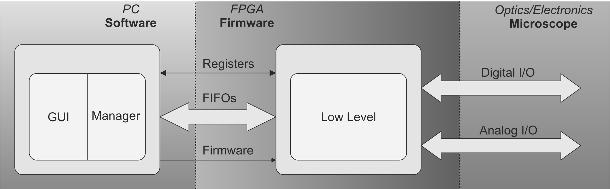
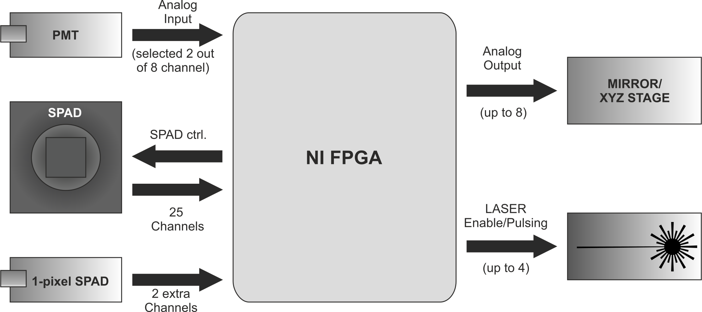

# Introduction

Fluorescence microscopy is an essential workhorse of biomedical sciences, thanks to its capabilities to provide specific and quantitative information of the observed specimens. The advent of super-resolution techniques has further improved the quality of the images produced by optical microscopes. Among the  numerous super-resolution techniques, image scanning microscopy (ISM)  emerged as a robust and reliable technique, being able to provide gentle imaging at high signal-to-noise ratio (SNR) with excellent optical sectioning​ [@Castello1; @Tortarolo1; @Perego1]​.  An ISM microscope shares the same architecture of a confocal laser scanning microscope (CLSM) but  exploits a pixeled detector. Each detector  element acts as a displaced  small pinhole and generates a confocal-like image after a full scan of the field of view.  As the detector is made by a matrix of pixel, the raw ISM dataset is not a 2D image, but it is a 4D dataset, which can be seen in two ways: for each single pixel scanned on the sample plane is associated a micro-image of the detector; vice-versa, for each physical pixel on the detector plane is associated a full-scanned field of view on the sample plane [@Sheppard1; @Muller1]​.  Using tailored reconstruction algorithms, the images of the raw ISM dataset can be fused to  produce a single super-resolution image using all the photons collected by the detector, guaranteeing an excellent SNR​ [@Zunino1; @Zunino2]​.

The capabilities of ISM can be further extended if coupled with a fast detector, such as an array of single photon avalanche diodes (SPAD)​ [@Buttafava1; @Slenders1]​.  These type of detector features the readout of each pixel is independent and asynchronized, preserving the temporal information of each photon arrival. In other words, it possible to tag each photon with its arrival time respect to the excitation  laser, expanding the dataset to a 5D array. This data can be used for estimating the fluorescence lifetime  allowing  the fluorescent lifetime imaging scanning microscopy (FLISM), a  microscopy technique which merges the temporal information together the ISM advantages mentioned above​ [@Tortarolo2; @Rossetta1]​.

In live-cell microscopy, the demand for high-resolution imaging coexists with the necessity to protect sample integrity.  Fast pixel dwell times are instrumental in this pursuit, minimizing sample damage while enhancing image quality. Leveraging the capabilities of the SPAD array detector, which can achieve megahertz photon flux per single pixel, requires an advanced data acquisition and control system based on FPGA technology. Existing open-source microscope control softwares, such as ImSwitch ​[@Moreno1]​ and µManager​ [@Edelstein1]​, have been designed for camera-based instruments. Integrating an imaging-scanning microscope's control system, which supports multichannel scanning microscopy, ensures synchronization of acquisition with a pixel dwell time as low as 1 µs, and manages high photon flux reaching megahertz rates, would compromise the performance of the aforementioned software architectures. Thus, those solutions are not practical for ISM instruments, necessitating a tailored software. In this context, the [BrightEye-MCS (Microscope Control Suite)](https://github.com/VicidominiLab/BrightEyes-MCS) is the new open-source tool written in Python, which allow the user to control a laser-scanning microscope equipped with a SPAD detector, providing a user-friendly GUI, real-time preview, and data saving in HDF5 ready to be processed internally or with external tools.

BrighEyes is the name of the project founded by the ERC in 2018 (Consolidator Grant, N. 818699). In this context, other open-source tools have been developed, like BrighEyes-TTM, an open-hardware time-tagging module [@Rossetta1], BrightEyes-ISM[@Zunino2], a python library for ISM data analysis.

# System Architecture

The BrightEyes-MCS controls and handle the data stream with the underlying hardware, based on field-programmable gate array (FPGA) from National Instrument (NI). These boards provide the digital inputs/outputs (I/O), and some models also provide analog I/Os. \autoref{fig:fig1} show a sketch of the system architecture.

The  system architecture features two parts: i) the low-level firmware (BrightEyes-MCSLL) managing the hardware and the electronics, running on the FPGA; ii) the high-level software (BrightEyes-MCS) which includes the GUI and its libraries running on the PC.

The firmware  was developed specifically for image scanning microscopy, on NI LabView for FPGA. It is a separated project, free, downloadable but it is not open  source. The firmware can be  controlled by the high-level software through registers and the data are streamed through dedicated FIFOs. Details are out of the scope of this paper and togheter with its documentation are available in the [BrightEyes-MCSLL](https://github.com/VicidominiLab/BrightEyes-MCSLL) repository.

Each time an acquisition starts, BrightEyes-MCS  loads automatically  the  firmware into the FPGA, set the registers (for example for configuring number of pixels, dwell-time)  and listen the data arriving through FIFO.

BrightEyes-MCS supports up to 25 digital channel (plus 2 extra channels), up-to 2 analog inputs. It controls the scanning and the positioning with a maximum speed of 1 us for pixel dwell time and it possible to set a further time-subdivision of the same pixel down to 0.5us per bin.

There is also the possibility to activate the so-called Digital Frequency Domain (DFD) mode ​ [@Tortarolo2]​. It is a heterodyne technique which allow to obtain higher time resolution. In this mode, the laser pulsing is driven by the FPGA,  and for each detector element it is acquired  the histogram of the time-arrival of the photons respect to the laser pulse (known as Time-Correlated Single Photon Counting, TCSPC), with a bin precision of 0.3 ns.

The software has been tested in a machine equipped with  an Intel Xeon CPU (2.2GHz) with 12 cores, and 32GByte of RAM. It was able to acquire  up-to 2000x2000x25x81 (x,y,ch,t)  datasets.

# Specifications

The specifications of BrightEyes-MCS depends on the hardware features of the NI FPGA used. To actuate the scanners, analog outputs are needed. Since not all FPGA models provide them, they can be replaced with an external independent board. 

+------------------------------------------+----------------------------------+--------------------------------------------------------------+------------------------------------------------+
| **Channels**                             | 25                                                                                                                                               |
+------------------------------------------+----------------------------------+--------------------------------------------------------------+------------------------------------------------+
| **Extra Channels**                       | 2                                                                                                                                                |
+------------------------------------------+----------------------------------+--------------------------------------------------------------+------------------------------------------------+
| **Analog Inputs Channels**               | 2 (selected out of 8), or not supported with external DAC                                                                                        |
+------------------------------------------+----------------------------------+--------------------------------------------------------------+------------------------------------------------+
| **Analog Output Channels**               | 8, or 4 with external DAC                                                                                                                        |
+------------------------------------------+----------------------------------+--------------------------------------------------------------+------------------------------------------------+
| **Pixel Dwell Time**                     | 1.0 µs                                                                                                                                           |
+------------------------------------------+----------------------------------+--------------------------------------------------------------+------------------------------------------------+
| **Minimum time bin**                     |  normal mode                     | 0.5 µs                                                                                                        |
+------------------------------------------+----------------------------------+--------------------------------------------------------------+------------------------------------------------+
|                                          |  DFD mode                        | 0.2 ns                                                                                                        |
+------------------------------------------+----------------------------------+--------------------------------------------------------------+------------------------------------------------+
| **Data storage**                         | HDF5, data and metadata                                                                                                                          |
+------------------------------------------+----------------------------------+--------------------------------------------------------------+------------------------------------------------+
| **Data array dimension**                 | repetition, z, y, x, time-bin, detector-channel                                                                                                  |
+------------------------------------------+----------------------------------+--------------------------------------------------------------+------------------------------------------------+
| **Boards tested**                        | *25 ch.*                         | - NI USB-7856R                                                                                                |
+------------------------------------------+----------------------------------+--------------------------------------------------------------+------------------------------------------------+
|                                          |                                  | - NI USB-7856R OEM                                                                                            |
+------------------------------------------+----------------------------------+--------------------------------------------------------------+------------------------------------------------+
|                                          |                                  | - NI PXIe-7856R                                                                                               |
+------------------------------------------+----------------------------------+--------------------------------------------------------------+------------------------------------------------+
|                                          |                                  | - NI PXIe-7822R                                              | (with external DAC*)                           |
+------------------------------------------+----------------------------------+--------------------------------------------------------------+------------------------------------------------+
|                                          |                                  | - NI PCIe-7820R                                              | (with external DAC*)                           |
+------------------------------------------+----------------------------------+--------------------------------------------------------------+------------------------------------------------+
|                                          |                                  |                                                              |                                                |
+------------------------------------------+----------------------------------+--------------------------------------------------------------+------------------------------------------------+
| *As external DAC has been tested the commercial evaluation board EVAL-AD5764 from Analog Device.                                                                                            |
+------------------------------------------+----------------------------------+--------------------------------------------------------------+------------------------------------------------+

\newpage

# Hardware and Electronics

This sketch shows the main electronics components controlled by BrightEyes-MCS. 

The sample positioning and the scanning are controlled by the analog outputs connected to a galvo mirrors, or a piezo stage. The analog  outputs supported are 8 and the user can select for each channel to be used as X,  Y,  Z or a constant voltage. The possibility of setting a constant voltage it is useful for others type of elements such as Acousto-optic modulator (AOM).

The support of photons multiplier tubes (PMTs)  is given by the read out two  analogue inputs  at the same time. The user can select the two analog  inputs  out of 8 channels.

In the case of the NI FPGA board used lacks the analog I/O, the analog outputs are provided by an external DAC  connected to the digital I/O of the FPGA. Similarly to it, we are planning to support for external ADC for providing the analog inputs.

The BrightEyes-MCS can control up-to 4 lasers through 4 digital output lines. They can be switched on and off easily at the start and end of a measurement. In the case of DFD mode – i.e. time-of-arrival / lifetime measurement – the system provides the synchronization clock to the lasers  for triggering the pulses.

\newpage

# Software Architecture

The Figure above shows the main parts of the BrightEyes-MCS Python code. The main process runs the GUI (MainWindow). When an acquisition is started the FPGAHandle instantiates other three parallel processes.

These processes are “infinite loops” (until the event end-of-acquisition), implemented using the [multiprocessing](https://docs.python.org/3/library/multiprocessing.html) library. As they are independent python instances, the communication between needs “shared” objects such as mp.Dict, mp.Event and MemorySharedArray (which uses mp.Array). Here below a short description of what the three processes:

1. The FpgaHandleProcess uploads and runs the firmware on the FPGA and listen commands from the Main and execute them. These commands are mainly related to read/write registers. This process continuously reading data available on the FIFOs from the FPGA, sending them to the DataPreProcess via a mp.Queue. The communication with the data is given by the [nifpga](https://nifpga-python.readthedocs.io/en/latest/) library. The FIFO readout can performed either with nifpga library or with [nifpga-fast-fifo-recv](https://pypi.org/project/nifpga-fast-fifo-recv/), a Python library written in Rust which we developed for reaching higher readout performances.

2. The DataPreProcess is just waiting data from the input Queue and cumulate them up to a given value and send them to the AcquisitionLoopProcess with an mp.Queue.

3. The AcquisitionLoopProcess is converting the raw data to a numpy array. This is performed by FastConverter, a function developed in Cython due-to performances reason. The converted data are reshaped and stored into a buffer used for the live preview and for saving the data to the HDF5 file [h5py library](https://docs.h5py.org/en/stable/).

The GUI is implemented with [PySide2 library](https://pypi.org/project/PySide2/). The images and the other plots are drawn by [PyQtGraph library](https://pygraph.readthedocs.io/it/latest/]). The GUI also provides an integrated Python console (which uses the library [QtConsole](https://qtconsole.readthedocs.io/en/stable/) ) which exposes all running objects. This means that on the console, the user can modify parts of the running software, in-live. This allows to run scripts for automatize operation, moreover, it allows to easily run scripts for example a quick data analysis at the end of the measurement. 

# Graphical User Interface (GUI)

The GUI is designed around the preview image, and it is composed by three parts.

- **Left Panel**:

  * **Detector Selection**: Choose between analogue and digital detectors and initiate either acquisition or preview mode. In acquisition, options include DFD mode for lifetime analysis and TTM activation (not part of this project).

  * **Temporal Settings**: Configure time resolution, dwell time, and laser delays.

  * **Acquisition Parameters**: Set pixel, line, frame, and repetition values for your imaging session.

  * **Configuration**: Adjust position, range, metadata, file storage preferences, selection of firmware, and advanced parameters for precise customization.

- **Central Area**:

  * **Preview Tab**: Observe real-time image preview during acquisition. Pan and zoom functionalities are enabled.

  * **FCS & Batch acq.**: Allow the autocorrelation preview for FCS, set up batch acquisiton

  * **Status**: A debug function for reading the status of the registers

  * **Cam**: A preview for external camera 

  * **ScriptLauncher**: A Python QTConsole in which all objects of the running software are exposed.
  
  * **DFD Preview**: A post-acquistion preview for FLIM

- **Right Panel**:

  * **Micro-Image Display**: View a 5x5 micro-image with options for cumulative or end-of-frame updates. Pixel saturation indication are highlighted in blue.

  * **Photon Flux Trace**: Track photon flux trends for the selected channel or sum throughout the scanning process.

  * **Settings Tabs**:

    - **Statistics**: Access imaging statistics for in-depth analysis.

    - **Input Selection**: Choose input options for analogue inputs.

    - **Output Configuration**: Define functionality for analogue outputs (scanning X, Y, Z, or constant voltage).

    - **Test Menu**: Explore test functionalities.

    - **Plugin Management**: Load and manage plugins seamlessly.

    - **Panorama Image**: Generate and update a panoramic image with the current preview image.

The commands are intuitive, and the software highlights possible error of configuration such to minimize the user errors.

# Conclusion

The BrightEyes-MCS is a new open-source tool for controlling image scanning microscope. It provides a real-time preview and supports up to 25 channels. It is designed for image-scanning microscopy with a SPAD array but allows easily to be used on different scenarios. For example, it can be used on a single-detector confocal microscope equipped with a single-pixel SPAD or PMT.  It can be used also outside the context of scanning microscopy as for example it is possible to use it in the context of Fluorescence correlation spectroscopy (FCS)​ [@Slenders2]​. Furthermore, the software can support single-molecule localization microscopy (SMLM) with non-conventional scanning patterns, such as MINFLUX and ISMFLUX​ [@Slenders3]​. Data acquired by BrightEyes-MCS are stored in HDF5 format, which can be easily opened with popular data analysis frameworks like Python notebooks or MATLAB. Additionally, a Python library called BrightEyes-ISM [@Zunino2] has been developed, enabling users to open these files and apply enhancement techniques such as APR[@Castello1] and Focus-ISM[@Tortarolo1]​​. For those using [Napari](napari.org), a plugin named [Napari-ISM](https://www.napari-hub.org/plugins/napari-ISM) is available, allowing the same enhancements to be performed within its graphical user interface.

As Python open-source tool can be easily adapted with other system. For example, BrightEyes-MCS has been integrated with BrightEyes-TTM, an open-source time-tagging module which allows to time-tag single photons with a resolution of about 30ps​ [@Rossetta1]​. It can be controlled by BrightEyes-MCS: every time an acquisition is starting the TTM remotely starts acquiring data in another machine. Moreover, BrightEyes-MCS can be controlled by external tools via HTTP REST APIs, which allow access to the GUI parameters, main commands (such as start acquisition, preview, and stop), and the preview image. This facilitates integration into a larger control framework, such as ImSwitch [@Moreno1]​ or Arkitekt [@Roos1].

In conclusion, BrightEyes-MCS presents a promising open-source solution for controlling image scanning microscopes. It features real-time preview and multi-channel support, offers great versatility for various microscopy setups. We envision that our open-source and free tool will be widely adopted by the scientific community, contributing to the dissemination of open-science culture in microscopy.

# Disclosures & Acknowledgements

G.V. has a personal financial interest (co-founder) in Genoa Instruments, Italy. The remaining authors declare no competing interests. We acknowledge our former colleagues, Marco Castello and Simonluca Piazza, now founder and respectively CTO and CEO of Genoa Instruments, for their important contributions to the firmware in the early stages of the project.
BrightEyes-MCS is designed to be an open-source software for research purposes and does not reflect the performance of the commercial products offered by Genoa Instruments.

# References
The repository of BrightEyes-MCS is [https://github.com/VicidominiLab/BrightEyes-MCS](https://github.com/VicidominiLab/BrightEyes-MCS).

